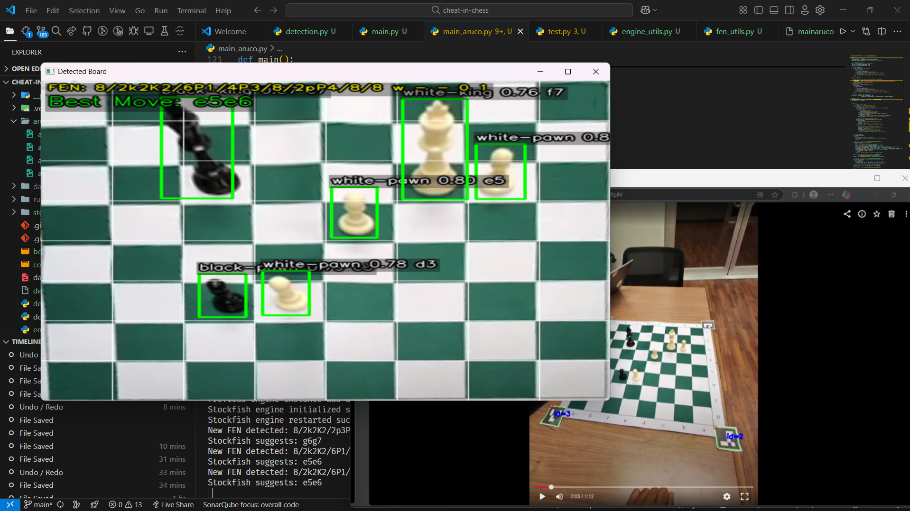

# Cheat‑in‑Chess

Real‑time chess assistant that watches your game through a webcam (or an optional Meta Ray‑Ban + OBS virtual cam), recognises every piece on the board, converts the position to FEN, queries Stockfish, **speaks** the best move in your ear, and prints a live Unicode board in the terminal.

<p align="center">
  
</p>

---

## Table of Contents
1. [Features](#features)  
2. [Architecture](#architecture)  
3. [Installation](#installation)  
4. [Configuration](#configuration)  
5. [Running the app](#running-the-app)  
6. [Troubleshooting](#troubleshooting)  
7. [Development log & Lessons learned](#development-log--lessons-learned)  
9. [Credits](#credits)

---

## Features

| ✅ | Description |
|----|-------------|
| **YOLOv8 piece detection** | Custom‑trained model recognises 12 piece classes at ~125 ms / frame on a mid‑tier laptop. |
| **ArUco marker cornering** | Four 4×4 tags on the board let us grab the *inner* corners for a perfect perspective warp. |
| **Perspective warp** | Converts any camera angle into a 512 × 512 top‑down view without stretching or cropping squares. |
| **FEN exporter** | Maps each detection to its square → builds a legal FEN in < 1 ms. |
| **Resilient Stockfish 17.1 wrapper** | Auto‑restarts the engine if it crashes, returns a sentinel after three failed launches. |
| **pyttsx3 TTS** | Speaks moves in natural language (“Knight takes e‑four, promote to Queen”). |
| **Unicode board in terminal** | Live diagram refreshes on every new position. |
| **Config‑first design** | All paths, board size, think time, etc. live in `config.py`. |

---

## Architecture

```
Camera / Virtual Cam ─┐
                      │  (OpenCV)
            detect_board_corners
         ┌────────────┴────────────┐
         │ Perspective Transform   │────▶ 512×512 board image
         └─────────────────────────┘
                           │
                           ▼
          YOLOv8 piece detector (detection.py)
                           │
                           ▼
                board_to_fen()  (fen_utils.py)
                           │
                           ▼
        get_best_move()  (engine_utils.py) ──▶ Stockfish
                           │
                           ▼
                 speak_move()  (voice_utils.py)
                           │
                           ▼
            draw_text_with_outline() + ascii_board

````

Each coloured block is its own Python module; `main_aruco.py` just glues them together.

---

## Installation

```bash
# 1. Clone
git clone https://github.com/krsnathkr/cheat-in-chess.git
cd cheat-in-chess

# 2. Create virtual env (Windows PowerShell)
python -m venv .venv
.venv\Scripts\activate

# 3. Install dependencies
pip install -r requirements.txt

# 4. Assets
   • YOLO weights → runs/detect/train3/weights/best.pt  
     (weights were trained on the four Roboflow datasets listed below)  
   • Stockfish 17.1 *modern* (POPCNT) → any folder; update STOCKFISH_PATH in config.py
```


### Dataset

The training data comes **only** from the following public Roboflow projects:

| Purpose                     | Source                                                                                                                                                                                             |
| --------------------------- | -------------------------------------------------------------------------------------------------------------------------------------------------------------------------------------------------- |
| Piece images (1)            | [https://universe.roboflow.com/block/chess-pieces-wrdbb](https://universe.roboflow.com/block/chess-pieces-wrdbb)                                                                                   |
| Piece images (2)            | [https://universe.roboflow.com/chduck/merge\_chess/dataset/1](https://universe.roboflow.com/chduck/merge_chess/dataset/1)                                                                          |
| Piece images (3)            | [https://universe.roboflow.com/chess-piece-detection-lydqy/chess-piece-detection-5ipnt/dataset/3](https://universe.roboflow.com/chess-piece-detection-lydqy/chess-piece-detection-5ipnt/dataset/3) |
| Board / square segmentation | [https://universe.roboflow.com/steven-lt9bf/chessboard-segmentation/model/1](https://universe.roboflow.com/steven-lt9bf/chessboard-segmentation/model/1)                                           |

Images from these sets were merged, cleaned, and used to train the YOLOv8 models.


### Minimum specs

* Python 3.11 + (tested on 3.13)
* Webcam ≥ 720p @ 30 fps
* CPU with POPCNT (any x64 since \~2010); AVX2 optional
* Windows 10/11 (tested) or a recent Linux kernel 5.4 +

> **Meta Ray‑Bans & OBS** are **optional** - any webcam feed works.

---

## Configuration

Edit **`config.py`**:

```python
STOCKFISH_PATH        = r"D:\engines\stockfish\stockfish-17.1-modern.exe"
BOARD_SIZE            = 512      # warped board resolution
STOCKFISH_THINK_TIME  = 0.5      # seconds the engine thinks per move
```

Camera index, speech rate, colours, etc. live here too.

---

## Running the app

```bash
(.venv) python main_aruco.py
```

Controls:

* **q** – quit

Two OpenCV windows appear plus a live ASCII board in the terminal.
Place the four ArUco markers at the board’s outer corners and start playing.

---

## Troubleshooting

|  Problem                           |  Fix                                                                           |
| ---------------------------------- | ------------------------------------------------------------------------------ |
| `Engine process died (0xC0000005)` | Use the *modern* (POPCNT) Stockfish build; AVX2 crashes on older CPUs.         |
| “Searching for board…” forever     | Markers not visible/IDs missing; print new tags via `python print_markers.py`. |
| Wrong piece mapping                | Retrain YOLO or update `detection.PIECE_CODE`.                                 |
| Frame lag > 200 ms                 | Reduce `BOARD_SIZE`, enable GPU in YOLO, or lower image size (`--img 416`).    |

---

## Development log & Lessons learned

### Board alignment hell 😵‍💫

* **Tried:** vanilla YOLO board detector, Canny + Hough, vanishing‑point grid, EMA/Kalman smoothing.
* **Issue:** non‑square angles & lens distortion blurred outer squares.
* **Solution:** four ArUco tags; take the *inner* corner → perfect warp every frame.

### Stockfish kept crashing

* AVX2 binary triggered `0xC0000005` on a Lenovo Yoga 7.
* **Fix 1:** switched to POPCNT build.
* **Fix 2:** wrote an auto‑restart wrapper (`engine_utils.py`) that returns `"Engine Crashed"` after three failures, so the GUI survives.

### YOLO mis‑classifications

* Knights vs bishops vs king vs queen under glare.
* Added 300 synthetic glare images → +8 F1.

### Audio latency

* Reduced TTS pitch, raised speed by \~30 wpm.
* Added queue‑drop so only the latest move is spoken.

---

## Credits

**Made by Krishna Thakar with <3** 

[LinkedIn](https://www.linkedin.com/in/krsnathkr/) & [ Personal Website](https://krsnathkr.github.io/)
